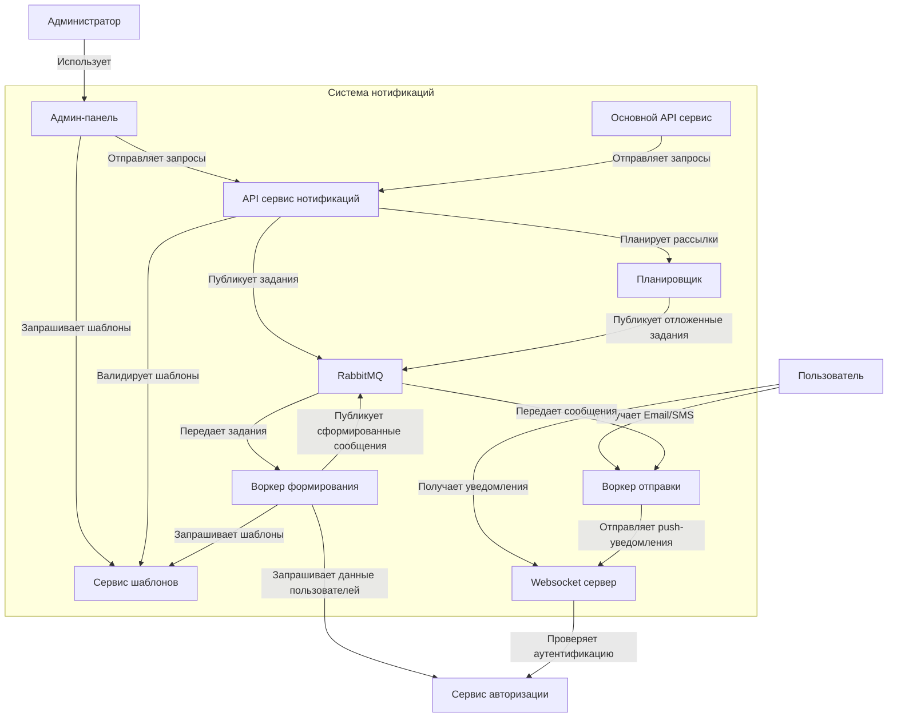
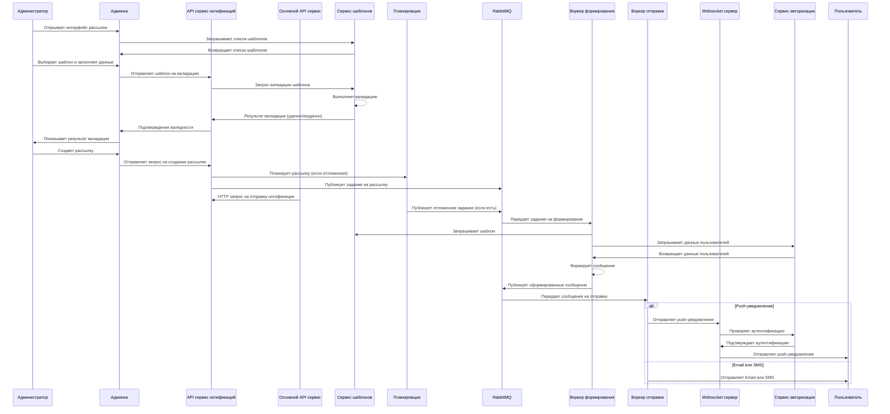

# Архитектура системы

## Диаграммы взаимлдействия между сервисами





## API Контракты системы нотификаций

### API сервис нотификаций

#### Создание рассылки

**Эндпоинт:** `POST /api/v1/notifications/campaigns`

**Тело запроса:**
```json
{
  "template_id": "string",
  "recipients": ["user_id1", "user_id2"],
  "schedule": "0 15 * * *",
  "parameters": {
    "key1": "value1",
    "key2": "value2"
  }
}
```

**Описание полей:**
- `template_id`: Идентификатор шаблона уведомления
- `recipients`: Список идентификаторов пользователей для рассылки
- `schedule`: Расписание в формате CRON. Пример "0 15 * * *" означает "каждый день в 15:00"
- `parameters`: Параметры для подстановки в шаблон

**Ответ:**
```json
{
  "campaign_id": "string",
  "status": "scheduled|pending|in_progress|completed|failed",
  "scheduled_time": "2023-05-20T15:00:00Z",
  "total_recipients": 100
}
```

**Описание статусов:**
- `scheduled`: Рассылка запланирована на будущее время
- `pending`: Рассылка ожидает обработки
- `in_progress`: Рассылка в процессе отправки
- `completed`: Рассылка успешно завершена
- `failed`: Произошла ошибка при выполнении рассылки

#### Валидация шаблона

**Эндпоинт:** `POST /api/v1/notifications/templates/validate`

**Тело запроса:**
```json
{
  "template_id": "string",
  "content": "string",
  "parameters": {
    "key1": "value1",
    "key2": "value2"
  }
}
```

**Ответ:**
```json
{
  "is_valid": true,
  "errors": ["error1", "error2"],
  "warnings": ["warning1", "warning2"],
  "rendered_content": "string"
}
```

**Описание полей:**
- `is_valid`: Флаг, указывающий на валидность шаблона
- `errors`: Список ошибок, если шаблон невалиден
- `warnings`: Список предупреждений
- `rendered_content`: Отрендеренный шаблон с подставленными тестовыми данными

### Сервис шаблонов

#### Получение списка шаблонов

**Эндпоинт:** `GET /api/v1/templates`

**Параметры запроса:**
- `type` (опционально): тип шаблона (email, sms, push)
- `page`: номер страницы
- `per_page`: количество элементов на странице

**Ответ:**
```json
{
  "templates": [
    {
      "id": "string",
      "name": "string",
      "type": "email|sms|push",
      "content": "string",
      "parameters": ["param1", "param2"],
      "created_at": "2023-05-20T15:00:00Z",
      "updated_at": "2023-05-20T15:00:00Z"
    }
  ],
  "total": 100,
  "page": 1,
  "per_page": 20
}
```

**Описание полей:**
- `content`: Содержание шаблона с плейсхолдерами
- `parameters`: Список параметров, которые нужно подставить в шаблон

#### Создание шаблона

**Эндпоинт:** `POST /api/v1/templates`

**Тело запроса:**
```json
{
  "name": "string",
  "type": "email|sms|push",
  "content": "string",
  "parameters": ["param1", "param2"]
}
```

**Ответ:**
```json
{
  "id": "string",
  "name": "string",
  "type": "email|sms|push",
  "content": "string",
  "parameters": ["param1", "param2"],
  "created_at": "2023-05-20T15:00:00Z"
}
```

### Основной API сервис

#### Отправка уведомления

**Эндпоинт:** `POST /api/v1/notifications/send`

**Тело запроса:**
```json
{
  "recipient_id": "string",
  "template_id": "string",
  "parameters": {
    "key1": "value1",
    "key2": "value2"
  },
  "channel": "email|sms|push"
}
```

**Ответ в случае успеха:**
```json
{
  "notification_id": "string",
  "status": "queued|sent|failed"
}
```

**Ответ в случае ошибки валидации:**
```json
{
  "error": "validation_error",
  "details": {
    "field": "error_description"
  }
}
```

**Описание статусов:**
- `queued`: Уведомление поставлено в очередь на отправку
- `sent`: Уведомление успешно отправлено
- `failed`: Произошла ошибка при отправке уведомления

### Форматы сообщений RabbitMQ

#### Задание на формирование уведомления

**Очередь:** `notification.formation`
**Routing Key:** `notification.formation.v1.task`

```json
{
  "task_id": "string",
  "template_id": "string",
  "recipient_ids": ["user_id1", "user_id2"],
  "parameters": {
    "key1": "value1",
    "key2": "value2"
  }
}
```

#### Сформированное уведомление

**Очередь:** `notification.sending`
**Routing Key:** `notification.sending.v1.task`

```json
{
  "notification_id": "string",
  "recipient_id": "string",
  "channel": "email|sms|push",
  "content": "string",
  "metadata": {
    "campaign_id": "string",
    "template_id": "string"
  }
}
```

**Правило именования ключей маршрутизации:** 
`[сущность]-reporting.[версия].[событие]`

Например:
- `user-reporting.v1.registered` - событие регистрации пользователя
- `movie-reporting.v1.added` - событие добавления нового фильма

### Websocket сервер

#### Подключение клиента

**URL:** `ws://your-domain.com/ws/notifications`

**Параметры запроса:**
- `token`: JWT токен для аутентификации

#### Формат сообщения push-уведомления

```json
{
  "type": "notification",
  "data": {
    "id": "string",
    "title": "string",
    "body": "string",
    "created_at": "2023-05-20T15:00:00Z"
  }
}
```

---

Примечание: Все эндпоинты требуют аутентификации. Используйте JWT токен в заголовке `Authorization: Bearer <token>`.