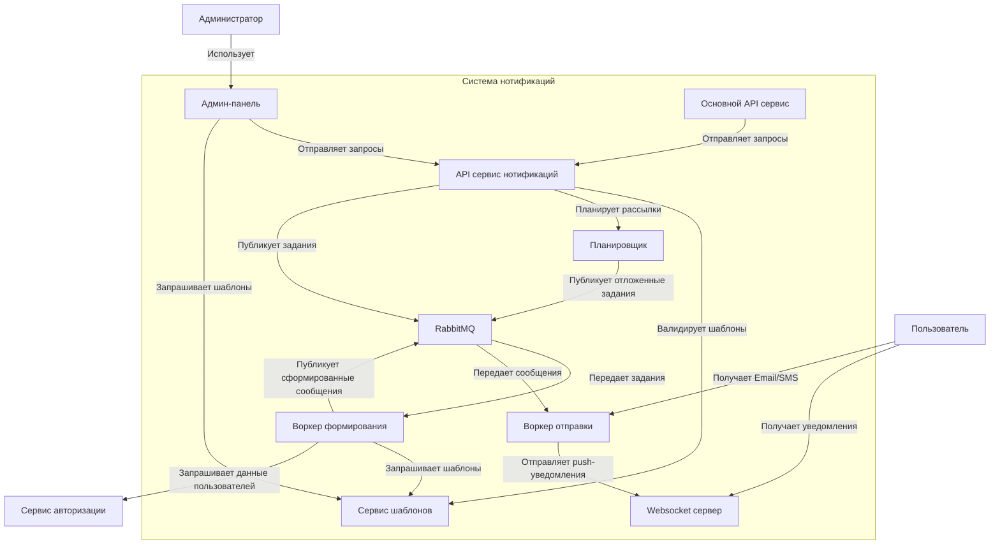
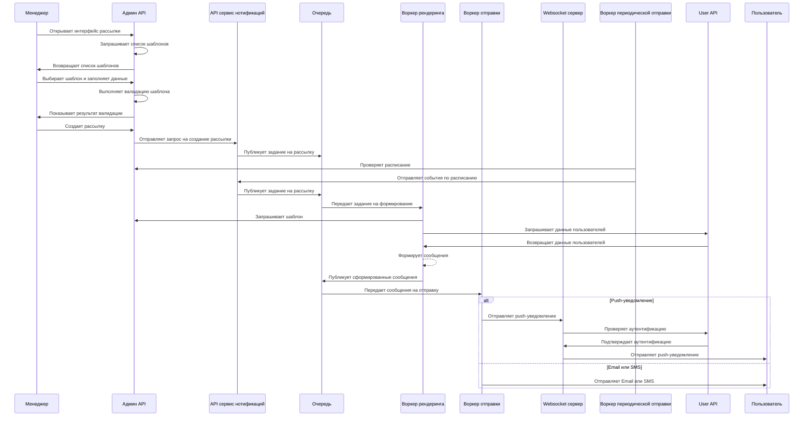

# Архитектура системы

## Диаграммы взаимлдействия между сервисами





## API Контракты системы нотификаций

### Админ API

#### Получение списка шаблонов

**Эндпоинт:** `GET /api/v1/admin/templates`

**Параметры запроса:**
- `type` (опционально): тип шаблона (email, sms, push)
- `page`: номер страницы
- `per_page`: количество элементов на странице

**Ответ:**
```json
{
  "templates": [
    {
      "id": "string",
      "name": "string",
      "type": "email|sms|push",
      "content": "string",
      "parameters": ["param1", "param2"],
      "created_at": "2023-05-20T15:00:00Z",
      "updated_at": "2023-05-20T15:00:00Z"
    }
  ],
  "total": 100,
  "page": 1,
  "per_page": 20
}
```

#### Создание шаблона

**Эндпоинт:** `POST /api/v1/admin/templates`

**Тело запроса:**
```json
{
  "name": "string",
  "type": "email|sms|push",
  "content": "string",
  "parameters": ["param1", "param2"]
}
```

**Ответ:**
```json
{
  "id": "string",
  "name": "string",
  "type": "email|sms|push",
  "content": "string",
  "parameters": ["param1", "param2"],
  "created_at": "2023-05-20T15:00:00Z"
}
```

#### Валидация шаблона

**Эндпоинт:** `POST /api/v1/admin/templates/validate`

**Тело запроса:**
```json
{
  "content": "string",
  "parameters": {
    "key1": "value1",
    "key2": "value2"
  }
}
```

**Ответ:**
```json
{
  "is_valid": true,
  "errors": ["error1", "error2"],
  "warnings": ["warning1", "warning2"],
  "rendered_content": "string"
}
```

#### Создание рассылки

**Эндпоинт:** `POST /api/v1/admin/campaigns`

**Тело запроса:**
```json
{
  "template_id": "string",
  "recipients": ["user_id1", "user_id2"],
  "schedule": "0 15 * * *",
  "parameters": {
    "key1": "value1",
    "key2": "value2"
  }
}
```

**Ответ:**
```json
{
  "campaign_id": "string",
  "status": "scheduled|pending|in_progress|completed|failed",
  "scheduled_time": "2023-05-20T15:00:00Z",
  "total_recipients": 100
}
```

#### Получение расписания периодических задач

**Эндпоинт:** `GET /api/v1/admin/periodic-tasks`

**Ответ:**
```json
{
  "tasks": [
    {
      "id": "string",
      "type": "notification|event",
      "schedule": "0 15 * * *",
      "last_run": "2023-05-20T15:00:00Z",
      "next_run": "2023-05-21T15:00:00Z"
    }
  ]
}
```

### API сервис нотификаций

#### Отправка уведомления

**Эндпоинт:** `POST /api/v1/notifications/send`

**Тело запроса:**
```json
{
  "recipient_id": "string",
  "template_id": "string",
  "parameters": {
    "key1": "value1",
    "key2": "value2"
  },
  "channel": "email|sms|push"
}
```

**Ответ:**
```json
{
  "notification_id": "string",
  "status": "queued|sent|failed"
}
```

#### Планирование события

**Эндпоинт:** `POST /api/v1/notifications/schedule`

**Тело запроса:**
```json
{
  "event_type": "string",
  "schedule": "0 15 * * *",
  "parameters": {
    "key1": "value1",
    "key2": "value2"
  }
}
```

**Ответ:**
```json
{
  "event_id": "string",
  "status": "scheduled"
}
```

### Форматы сообщений в очереди

#### Задание на формирование уведомления

**Очередь:** `notification.formation`
**Routing Key:** `notification.formation.v1.task`

```json
{
  "task_id": "string",
  "template_id": "string",
  "recipient_ids": ["user_id1", "user_id2"],
  "parameters": {
    "key1": "value1",
    "key2": "value2"
  }
}
```

#### Сформированное уведомление

**Очередь:** `notification.sending`
**Routing Key:** `notification.sending.v1.task`

```json
{
  "notification_id": "string",
  "recipient_id": "string",
  "channel": "email|sms|push",
  "content": "string",
  "metadata": {
    "campaign_id": "string",
    "template_id": "string"
  }
}
```

### Websocket сервер

#### Подключение клиента

**URL:** `ws://your-domain.com/ws/notifications`

**Параметры запроса:**
- `token`: JWT токен для аутентификации

#### Формат сообщения push-уведомления

```json
{
  "type": "notification",
  "data": {
    "id": "string",
    "title": "string",
    "body": "string",
    "created_at": "2023-05-20T15:00:00Z"
  }
}
```

---

Примечание: Все эндпоинты требуют аутентификации. Используйте JWT токен в заголовке `Authorization: Bearer <token>`.
